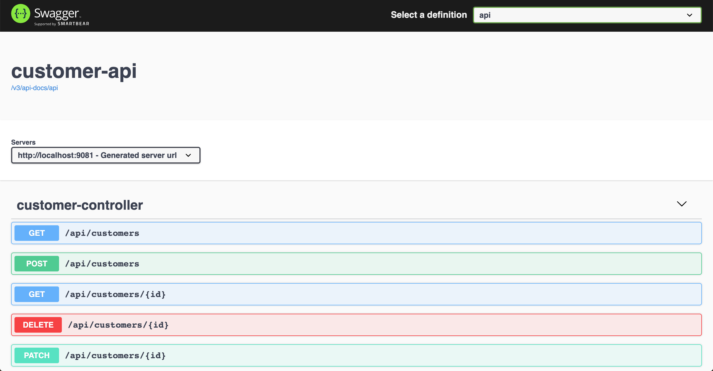

# spring-webflux-client-server

The goal of this project is to play with [`Spring WebFlux`](https://docs.spring.io/spring/docs/current/spring-framework-reference/web-reactive.html) both on client and server side. For it, we will implement [`Spring Boot`](https://docs.spring.io/spring-boot/docs/current/reference/htmlsingle/) Java Web applications (`product-api`, `customer-api`, `order-api` and `client-shell`) and use reactive NoSQL database like [`Cassandra`](https://cassandra.apache.org/), [`MongoDB`](https://www.mongodb.com/) and [`Couchbase`](https://www.couchbase.com/).

## Project Architecture


## Applications

- **product-api**

  `Spring Boot` Java Web application that exposes a REST API to manage `products`. It uses `MongoDB` as storage.
  
  

- **customer-api**

  `Spring Boot` Java Web application that exposes a REST API to manage `customers`. It uses `Couchbase` as storage.
  
  

- **order-api**

  `Spring Boot` Web Java application that exposes a REST API to manage `orders`. It uses `Cassandra` as storage. In order to get more information about an `order`, i.e, the `name` of the customer who placed it or the `name` or `price` of the products in the order, `order-api` uses [`WebClient`](https://docs.spring.io/spring/docs/current/spring-framework-reference/web-reactive.html#webflux-client) and [`CompletableFuture`](https://docs.oracle.com/javase/8/docs/api/java/util/concurrent/CompletableFuture.html) to fetch those information from `customer-api` and `product-api`.
  
  

- **client-shell**

  `Spring Boot` Shell Java application that has a couple of commands to interact with `product-api`, `customer-api` and `order-api`. The picture below show those commands.

  
  
## Prerequisites

- `Java 11+`
- `Docker`
- `Docker-Compose`

## Start Environment

- Open a terminal and inside `spring-webflux-client-server` root folder run
  ```
  docker-compose up -d
  ```

- Wait a little bit until all containers are Up (healthy). You can check their status running
  ```
  docker-compose ps
  ```

- Run the script below to initialize `Couchbase` database that is used by `customer-api`
  ```
  ./setup-couchbase.sh
  ```

## Start applications

- **product-api**

  Open a new terminal and, inside `spring-webflux-client-server` root folder, run the following command
  ```
  ./mvnw clean spring-boot:run --projects product-api -Dspring-boot.run.jvmArguments="-Dserver.port=9080"
  ```

- **customer-api**

  Open a new terminal and, inside `spring-webflux-client-server` root folder, run the following command
  ```
  ./mvnw clean spring-boot:run --projects customer-api -Dspring-boot.run.jvmArguments="-Dserver.port=9081"
  ```

- **order-api**

  Open a new terminal and, inside `spring-webflux-client-server` root folder, run the following command 
  ```
  ./mvnw clean spring-boot:run --projects order-api -Dspring-boot.run.jvmArguments="-Dserver.port=9082"
  ```

- **client-shell**

  Open a new terminal and, inside `spring-webflux-client-server` root folder, run the following command to build the executable jar file
  ```
  ./mvnw clean package -DskipTests --projects client-shell
  ```

  To start `client-shell` run
  ```
  ./client-shell/target/client-shell-0.0.1-SNAPSHOT.jar
  ```

## Applications URLs

| Application  | URL                                   |
| ------------ | ------------------------------------- |
| product-api  | http://localhost:9080/swagger-ui.html |
| customer-api | http://localhost:9081/swagger-ui.html |
| order-api    | http://localhost:9082/swagger-ui.html | 

## Playing around

> **Important:** the ids shown below will be different when you run it

- Go to `client-shell` terminal and import some products and customers by running the following command
  ```
  script ../samples.txt
  ```
  
- Get all customer
  ```
  get-customers
  ```
  
  It returns
  ```
  {
    "id": "48490549-a212-4c0a-a49b-0984d4a35a59",
    "name": "Customer A",
    "email": "customer.a@test.com",
    "address": { "city": "Berlin", "street": "NYC Strasse", "number": "123" }
  }
  ...
  ```
  
- Get all products
  ```
  get-products
  ```
  
  It returns
  ```
  {"id":"5e81002fdc0f4717978533e8","name":"product-1","price":199.99}
  {"id":"5e81002fdc0f4717978533e9","name":"product-2","price":299.99}
  ...
  ```
  
- Create an order where `Customer A` buys `1 unit` of `product-1` and `2 units` of `product-2`
  ```
  create-order --customer-id 48490549-a212-4c0a-a49b-0984d4a35a59 --products 5e81002fdc0f4717978533e8:1;5e81002fdc0f4717978533e9:2
  ```
  
  It returns
  ```
  {
    "orderId": "db5067ad-27c0-4dc8-b106-3ad8ffa43450",
    "status": "OPEN",
    "created": "2020-03-29T21:19:45.549",
    "products": [
      { "id": "5e81002fdc0f4717978533e9", "quantity": 2 },
      { "id": "5e81002fdc0f4717978533e8", "quantity": 1 }
    ],
    "customerId": "48490549-a212-4c0a-a49b-0984d4a35a59"
  }
  ```
  
- Get details about the order created
  ```
  get-order-detailed db5067ad-27c0-4dc8-b106-3ad8ffa43450
  ```
  
  It returns
  ```
  {
    "orderId": "db5067ad-27c0-4dc8-b106-3ad8ffa43450",
    "status": "OPEN",
    "created": "2020-03-29T21:19:45.549",
    "products": [
      { "id": "5e81002fdc0f4717978533e8", "name": "product-1", "quantity": 1, "price": 199.99 },
      { "id": "5e81002fdc0f4717978533e9", "name": "product-2", "quantity": 2, "price": 299.99 }
    ],
    "customer": {
      "id": "48490549-a212-4c0a-a49b-0984d4a35a59",
      "name": "Customer A",
      "email": "customer.a@test.com",
      "address": { "city": "Berlin", "street": "NYC Strasse", "number": "123" }
    }
  }
  ```
  
- To check how fast `order-api` get details about customer and products of an order, create another order where `Customer A` order `50` random products
  ```
  create-order-random --customer-id 48490549-a212-4c0a-a49b-0984d4a35a59 --num-products 50
  ```
  
  It returns
  ```
  {
    "orderId": "f983e12f-51c6-41e3-ab17-305e62d490f2",
    "status": "OPEN",
    "created": "2020-03-29T22:47:58.51",
    "products": [
      { "id": "5e810030dc0f471797853409", "quantity": 3 },
      ...
      { "id": "5e81002fdc0f4717978533ea", "quantity": 5 }
    ],
    "customerId": "48490549-a212-4c0a-a49b-0984d4a35a59"
  }
  ```
  
- In another terminal, to get the details of the order previously created and the response time of this call, we we are using `order-api`'s endpoint `GET ​/api​/orders​/{orderId}​/detailed`
  ```
  curl -w "\n\nResponse Time: %{time_total}s" -s localhost:9082/api/orders/f983e12f-51c6-41e3-ab17-305e62d490f2/detailed
  ```
  
  It will return
  ```
  {
    "orderId": "f983e12f-51c6-41e3-ab17-305e62d490f2",
    "status": "OPEN",
    "created": "2020-03-29T22:47:58.51",
    "products": [
      ...
    ],
    "customer": {
      ...
    }
  }
  
  Response Time: 0.292698s
  ```

## Shutdown

- Go to `client-shell` terminal and type `exit`

- Go to `product-api`, `customer-api` and `order-api` terminals and press `Ctrl+C` on each one

- To stop and remove docker-compose containers, network and volumes, run
  ```
  docker-compose down -v
  ```

## Useful Commands & Links

- **Cassandra**

  Select all orders
  ```
  docker exec -it cassandra cqlsh
  USE mycompany;
  SELECT * FROM orders;
  ```
  > Type `exit` to get out of `cqlsh`

- **MongoDB**

  Find all products
  ```
  docker exec -it mongodb mongo
  use productdb
  db.products.find()
  ```
  > Type `exit` to get out of `MongoDB shell`

- **Couchbase**

  Couchbase Web Console can be accessed at http://localhost:8091
  
  The login credentials are
  ```
  username: Administrator
  password: password
  ```

## TODO

- Validate if customer and products exist before creating an order

## Issues

- `Customer` model in `customer-api` should be saved in `Couchbase` as
  ```
  {
    "address": { "number": "234", "city": "Berlin", "street": "LA Strasse" },
    "name": "Customer B",
    "_class": "com.mycompany.customerapi.model.Customer",
    "email": "customer.b@test.com"
  }
  ```
  
  However, the address information is added inside a `content`; besides, an `id` and `expiration` to address. I've opened this [issue](https://github.com/spring-projects/spring-data-examples/issues/572) 
  ```
  {
    "address": {
      "content": { "number": "234", "city": "Berlin", "street": "LA Strasse" },
      "id": null,
      "expiration": 0
    },
    "name": "Customer B",
    "_class": "com.mycompany.customerapi.model.Customer",
    "email": "customer.b@test.com"
  }
  ```
  
- Openapi `@Schema` annotation not working on nested classes as described in this issue [Nested objects not getting exampe values from @Schema](https://github.com/swagger-api/swagger-core/issues/3584)
