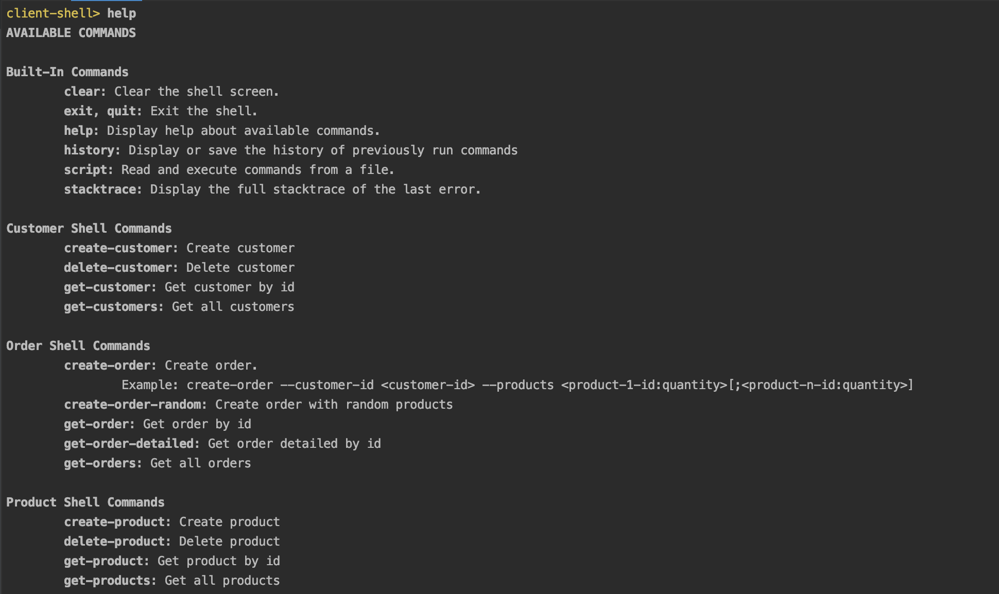

# `spring-webflux-client-server`

The goal of this project is to play with [`Spring WebFlux`](https://docs.spring.io/spring/docs/current/spring-framework-reference/web-reactive.html)
both on client and server side. For it, we will implement some [`Spring Boot`](https://docs.spring.io/spring-boot/docs/current/reference/htmlsingle/)
Java Web applications, `product-api`, `customer-api`, `order-api` and `client-shell`, and use reactive NoSQL database
like [`Cassandra`](https://cassandra.apache.org/), [`MongoDB`](https://www.mongodb.com/) and [`Couchbase`](https://www.couchbase.com/).

## Project Architecture


## Applications

### product-api

`Spring Boot` Java Web application that exposes a REST API to manage `products`. It uses `MongoDB` as storage.

### customer-api

`Spring Boot` Java Web application that exposes a REST API to manage `customers`. It uses `Couchbase` as storage.

### order-api

`Spring Boot` Web Java application that exposes a REST API to manage `orders`. It uses `Cassandra` as storage. In order
to get more information about an `order`, i.e, the `name` of the customer who placed it or the `name` or `price` of
the products in the order, `order-api` uses [`WebClient`](https://docs.spring.io/spring/docs/current/spring-framework-reference/web-reactive.html#webflux-client)
and [`CompletableFuture`](https://docs.oracle.com/javase/8/docs/api/java/util/concurrent/CompletableFuture.html) to
fetch those information from `customer-api` and `product-api`.

### client-shell

`Spring Boot` Shell Java application that has a couple of commands to interact with `product-api`, `customer-api` and
`order-api`. The picture below show those commands.



## Start Environment

Open a terminal and inside `spring-webflux-client-server` root folder run
```
docker-compose up -d
```

Wait a little bit until all containers are Up (healthy). You can check their status running
```
docker-compose ps
```

Then, still inside `spring-webflux-client-server` root folder, run the script below. It will initialize
`Couchbase` database that is used by `customer-api`
```
./setup-couchbase.sh
```

## Start applications

### product-api

Open a new terminal and, inside `spring-webflux-client-server` root folder, run the following command
```
./mvnw spring-boot:run --projects product-api -Dspring-boot.run.jvmArguments="-Dserver.port=9080"
```

### customer-api

Open a new terminal and, inside `spring-webflux-client-server` root folder, run the following command
```
./mvnw spring-boot:run --projects customer-api -Dspring-boot.run.jvmArguments="-Dserver.port=9081"
```

### order-api

Open a new terminal and, inside `spring-webflux-client-server` root folder, run the following command 
```
./mvnw spring-boot:run --projects order-api -Dspring-boot.run.jvmArguments="-Dserver.port=9082"
```

### client-shell

Open a new terminal and, inside `spring-webflux-client-server` root folder, run the following command to build the
executable jar file
```
./mvnw clean package -DskipTests --projects client-shell
```

Then, to start `client-shell` run
```
./client-shell/target/client-shell-0.0.1-SNAPSHOT.jar 
```

## Applications URLs

| Application  | URL                                   |
| ------------ | ------------------------------------- |
| product-api  | http://localhost:9080/swagger-ui.html |
| customer-api | http://localhost:9081/swagger-ui.html |
| order-api    | http://localhost:9082/swagger-ui.html | 

## Shutdown

Go to `client-shell` terminal and type `exit`. Then, go to `product-api`, `customer-api` and `order-api` terminals
and press `ctrl-c` on each one.

Finally, to stop and remove containers, networks and volumes, run
```
docker-compose down -v
```

## Useful Commands & Links

### Import fake products and customers

In `client-shell` folder there is the `samples.txt` file that contains some fake products and customers. In order to
import them, run the following command in `client-shell` terminal
```
client-shell> script ../samples.txt
```

### Cassandra

Select all orders
```
docker exec -it cassandra cqlsh
USE mycompany;
SELECT * FROM orders;
```
> Type `exit` to get out of `cqlsh`

### MongoDB

Find all products
```
docker exec -it mongodb mongo
use productdb
db.products.find()
```
> Type `exit` to get out of `MongoDB shell`

### Couchbase

Couchbase Web Console can be accessed at http://localhost:8091.

The login credentials are
```
username: Administrator
password: password
```

## TODO

- validate if customer and products exist before creating an order
