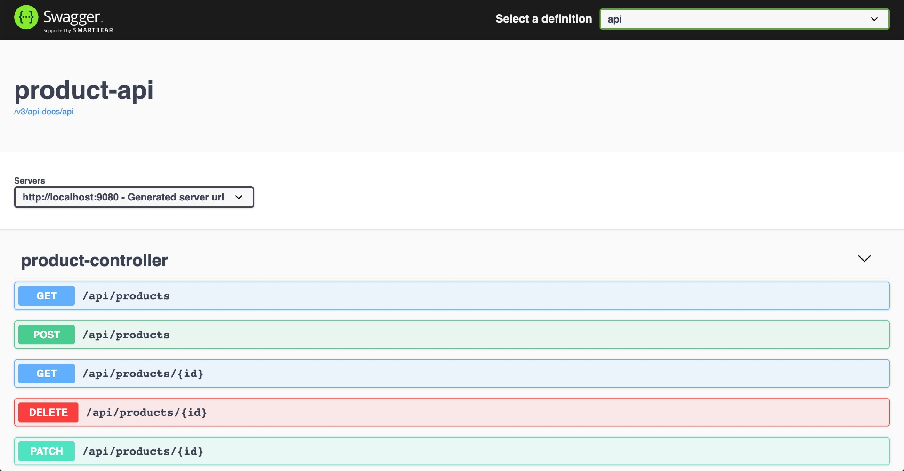
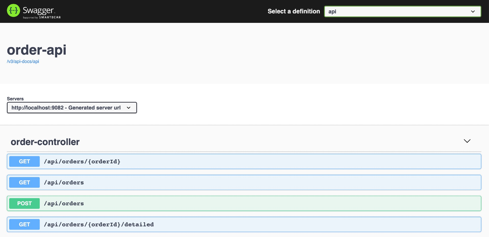
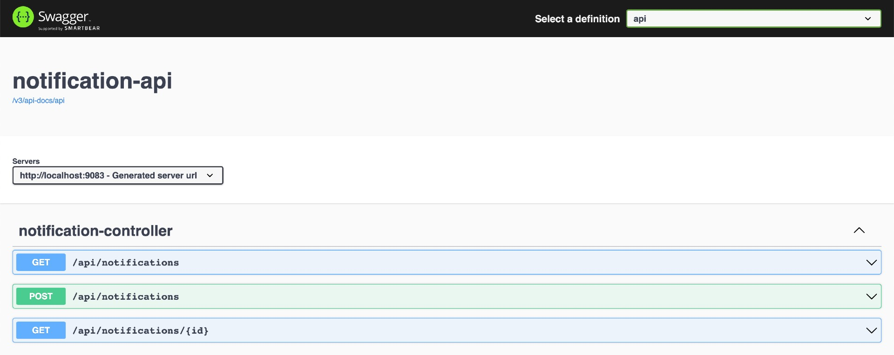

# spring-webflux-reactive-databases

The goal of this project is to play with [`Spring WebFlux`](https://docs.spring.io/spring/docs/current/spring-framework-reference/web-reactive.html) both on client and server side. For it, we will implement [`Spring Boot`](https://docs.spring.io/spring-boot/docs/current/reference/htmlsingle/) Java Web applications (`product-api`, `customer-api`, `order-api`, `notification-api` and `client-shell`) and use different databases like [`Cassandra`](https://cassandra.apache.org/), [`MongoDB`](https://www.mongodb.com/), [`Postgres`](https://www.postgresql.org/) and [`MySQL`](https://www.mysql.com/).

## Project Architecture


## Applications

- ### product-api

  `Spring Boot` Java Web application that exposes a REST API to manage `products`. It uses `MongoDB` as storage.
  
  

- ### customer-api

  `Spring Boot` Java Web application that exposes a REST API to manage `customers`. It uses `Postgres` as storage.
  
  

- ### order-api

  `Spring Boot` Web Java application that exposes a REST API to manage `orders`. It uses `Cassandra` as storage. In order to get more information about an `order`, i.e, the `name` of the customer who placed it or the `name` or `price` of the products in the order, `order-api` uses [`WebClient`](https://docs.spring.io/spring/docs/current/spring-framework-reference/web-reactive.html#webflux-client) and [`CompletableFuture`](https://docs.oracle.com/javase/8/docs/api/java/util/concurrent/CompletableFuture.html) to fetch this information from `customer-api` and `product-api`.
  
  

- ### notification-api

  `Spring Boot` Web Java application that exposes a REST API to manage `notifications`.

  

- ### client-shell

  `Spring Boot` Shell Java application that has a couple of commands to interact with `product-api`, `customer-api`, `order-api` and `notification-api`. The picture below show those commands.

  
  
## Prerequisites

- [`Java 11+`](https://www.oracle.com/java/technologies/downloads/#java11)
- [`Docker`](https://www.docker.com/)
- [`Docker-Compose`](https://docs.docker.com/compose/install/)

## Start Environment

- Open a terminal and inside `spring-webflux-reactive-databases` root folder run
  ```
  docker-compose up -d
  ```

- Wait for Docker containers to be up and running. To check it, run
  ```
  docker-compose ps
  ```

## Run applications with Maven

- **product-api**

  Open a new terminal and, inside `spring-webflux-reactive-databases` root folder, run the following command
  ```
  ./mvnw clean spring-boot:run --projects product-api
  ```

- **customer-api**

  Open a new terminal and, inside `spring-webflux-reactive-databases` root folder, run the following command
  ```
  ./mvnw clean spring-boot:run --projects customer-api
  ```

- **order-api**

  Open a new terminal and, inside `spring-webflux-reactive-databases` root folder, run the following command 
  ```
  ./mvnw clean spring-boot:run --projects order-api
  ```

- **notification-api**

  Open a new terminal and, inside `spring-webflux-reactive-databases` root folder, run the following command
  ```
  ./mvnw clean spring-boot:run --projects notification-api
  ```

- **client-shell**

  Open a new terminal and, inside `spring-webflux-reactive-databases` root folder, run the following command to build the executable jar file
  ```
  ./mvnw clean package --projects client-shell -DskipTests
  ```

  To start `client-shell` run
  ```
  ./client-shell/target/client-shell-1.0.0.jar
  ```

## Run applications as Docker containers

- ### Build Docker Images
  
  - In a terminal, make sure you are in `spring-webflux-reactive-databases` root folder
  - Run the following script to build the Docker images
    - JVM
      ```
      ./docker-build.sh
      ```
    - Native (it's not implemented yet)
      ```
      ./docker-build.sh native
      ```

- ### Environment Variables

  - **product-api**

    | Environment Variable | Description                                                       |
    |----------------------|-------------------------------------------------------------------|
    | `MONGODB_HOST`       | Specify host of the `Mongo` database to use (default `localhost`) |
    | `MONGODB_PORT`       | Specify port of the `Mongo` database to use (default `27017`)     |

  - **customer-api**

    | Environment Variable | Description                                                          |
    |----------------------|----------------------------------------------------------------------|
    | `POSTGRES_HOST`      | Specify host of the `Postgres` database to use (default `localhost`) |
    | `POSTGRES_PORT`      | Specify port of the `Postgres` database to use (default `5432`)      |

  - **order-api**

    | Environment Variable | Description                                                           |
    |----------------------|-----------------------------------------------------------------------|
    | `CASSANDRA_HOST`     | Specify host of the `Cassandra` database to use (default `localhost`) |
    | `CASSANDRA_PORT`     | Specify port of the `Cassandra` database to use (default `9042`)      |
    | `PRODUCT_API_HOST`   | Specify host of the `product-api` to use (default `localhost`)        |
    | `PRODUCT_API_PORT`   | Specify port of the `product-api` to use (default `9080`)             |
    | `CUSTOMER_API_HOST`  | Specify host of the `customer-api` to use (default `localhost`)       |
    | `CUSTOMER_API_PORT`  | Specify port of the `customer-api` to use (default `9081`)            |

  - **notification-api**

    | Environment Variable | Description                                                       |
    |----------------------|-------------------------------------------------------------------|
    | `MYSQL_HOST`         | Specify host of the `MySQL` database to use (default `localhost`) |
    | `MYSQL_PORT`         | Specify port of the `MySQL` database to use (default `3306`)      |
    | `CUSTOMER_API_HOST`  | Specify host of the `customer-api` to use (default `localhost`)   |
    | `CUSTOMER_API_PORT`  | Specify port of the `customer-api` to use (default `9081`)        |
    | `ORDER_API_HOST`     | Specify host of the `order-api` to use (default `localhost`)      |
    | `ORDER_API_PORT`     | Specify port of the `order-api` to use (default `9082`)           |

  - **client-shell**

    | Environment Variable    | Description                                                         |
    |-------------------------|---------------------------------------------------------------------|
    | `PRODUCT_API_HOST`      | Specify host of the `product-api` to use (default `localhost`)      |
    | `PRODUCT_API_PORT`      | Specify port of the `product-api` to use (default `9080`)           |
    | `CUSTOMER_API_HOST`     | Specify host of the `customer-api` to use (default `localhost`)     |
    | `CUSTOMER_API_PORT`     | Specify port of the `customer-api` to use (default `9081`)          |
    | `ORDER_API_HOST`        | Specify host of the `order-api` to use (default `localhost`)        |
    | `ORDER_API_PORT`        | Specify port of the `order-api` to use (default `9082`)             |
    | `NOTIFICATION_API_HOST` | Specify host of the `notification-api` to use (default `localhost`) |
    | `NOTIFICATION_API_PORT` | Specify port of the `notification-api` to use (default `9083`)      |

- ### Start Docker Containers

  - In a terminal, make sure you are inside `spring-webflux-reactive-databases` root folder
  - Run following command
    ```
    ./start-apis.sh && ./start-shell.sh
    ```
    
## Application's URL

| Application      | URL                                         |
|------------------|---------------------------------------------|
| product-api      | http://localhost:9080/swagger-ui/index.html |
| customer-api     | http://localhost:9081/swagger-ui/index.html |
| order-api        | http://localhost:9082/swagger-ui/index.html |
| notification-api | http://localhost:9083/swagger-ui/index.html |

## Playing around

> **Important:** the ids shown below will be different when you run it

- In `client-shell` terminal, import some products and customers by running the following command
  - If you are running using `Maven`
    ```
    script ../src/main/resources/samples.txt
    ```
  - If you are running as Docker container
    ```
    script /app/resources/samples.txt
    ```
    
- Get all customer
  ```
  get-customers
  ```
  
  It should return
  ```
  {"id":"1","name":"Customer A","email":"customer.a@test.com","city":"Berlin","street":"NYC Strasse","number":"123"}
  {"id":"2","name":"Customer B","email":"customer.b@test.com","city":"Berlin","street":"LA Strasse","number":"234"}
  {"id":"3","name":"Customer C","email":"customer.c@test.com","city":"Berlin","street":"DC Strasse","number":"345"}
  ...
  ```
  
- Get all products
  ```
  get-products
  ```
  
  It should return
  ```
  {"id":"5ee3ee31b460d868af49f389","name":"product-1","price":199.99}
  {"id":"5ee3ee32b460d868af49f38a","name":"product-2","price":299.99}
  ...
  ```
  
- Create an order where `Customer A` buys `1 unit` of `product-1` and `2 units` of `product-2`
  ```
  create-order --customer-id 1 --products 5ee3ee31b460d868af49f389:1;5ee3ee32b460d868af49f38a:2
  ```
  
  It should return
  ```
  {
    "orderId": "5aaad64c-4e80-48e0-926d-8f1b7027955a",
    "status": "OPEN",
    "created": "2020-06-12T22:09:59.558232",
    "products": [
      {"id": "5ee3ee31b460d868af49f389","quantity": 1},
      {"id": "5ee3ee32b460d868af49f38a","quantity": 2}
    ],
    "customerId": "1"
  }
  ```
  
- Get details about the order created
  ```
  get-order-detailed 5aaad64c-4e80-48e0-926d-8f1b7027955a
  ```
  
  It should return
  ```
  {
    "orderId": "5aaad64c-4e80-48e0-926d-8f1b7027955a",
    "status": "OPEN",
    "created": "2020-06-12T22:09:59.558",
    "products": [
      {"id": "5ee3ee32b460d868af49f38a","name": "product-2","quantity": 2,"price": 299.99},
      {"id": "5ee3ee31b460d868af49f389","name": "product-1","quantity": 1,"price": 199.99}
    ],
    "customer": {
      "id": "1",
      "name": "Customer A",
      "email": "customer.a@test.com",
      "city": "Berlin",
      "street": "NYC Strasse",
      "number": "123"
    }
  }
  ```

- To create a notification to the order created above
  ```
  create-notification 5aaad64c-4e80-48e0-926d-8f1b7027955a
  ```

- To check how fast `order-api` get details about the customer and products of an order, create another order where `Customer A` order `50` random products
  ```
  create-order-random --customer-id 1 --num-products 50
  ```
  
  It should return
  ```
  {
    "orderId": "87133d36-67f0-4388-b15b-7d66ad739374",
    "status": "OPEN",
    "created": "2020-06-12T22:14:08.342338",
    "products": [
      {"id": "5ee3ee32b460d868af49f38a","quantity": 4},
      ...
      {"id": "5ee3ee32b460d868af49f396","quantity": 3}
    ],
    "customerId": "1"
  }
  ```
  
- In another terminal, to get the details of the order previously created and the response time of this call, we are using `order-api`'s endpoint `GET /api/orders/{orderId}/detailed`
  ```
  curl -w "\n\nResponse Time: %{time_total}s" -s localhost:9082/api/orders/87133d36-67f0-4388-b15b-7d66ad739374/detailed
  ```
  
  It will return something like
  ```
  {
    "orderId": "87133d36-67f0-4388-b15b-7d66ad739374",
    "status": "OPEN",
    "created": "2020-06-12T22:14:08.342338",
    "products": [
      {"id": "5ee3ee32b460d868af49f395","name": "product-13","quantity": 4,"price": 1399.99},
      ...
    ],
    "customer": {
      "id": "1",
      "name": "Customer A",
      "email": "customer.a@test.com",
      "city": "Berlin",
      "street": "NYC Strasse",
      "number": "123"
    }
  }
  
  Response Time: 0.292698s
  ```

## Useful Commands

- **Cassandra**

  ```
  docker exec -it cassandra cqlsh
  USE mycompany;
  SELECT * FROM orders;
  ```
  > Type `exit` to get out of `cqlsh`

- **MongoDB**

  ```
  docker exec -it mongodb mongo
  use productdb
  db.products.find()
  ```
  > Type `exit` to get out of `MongoDB shell`

- **Postgres**

  ```
  docker exec -it postgres psql -U postgres -d customerdb
  \dt customer
  SELECT * FROM CUSTOMER;
  ```
  > Type `exit` to get out of `psql`

- **MySQL**

  ```
  docker exec -it -e MYSQL_PWD=secret mysql mysql -uroot --database notificationdb
  SELECT * FROM notification;
  ```
  > Type `exit` to get out of `MySQL monitor`

## Shutdown

- To stop `client-shell`, go to the terminal where it is running and type `exit`
- To stop `product-api`, `customer-api` and `order-api` 
  - If you start them with `Maven`, go to the terminals were they are running and press `Ctrl+C`
  - If you start them as Docker containers, go to a terminal and, inside `spring-webflux-reactive-databases` root folder, run the following script
    ```
    ./stop-apis.sh
    ```
- To stop and remove docker-compose containers, network and volumes, go to a terminal and, inside `spring-webflux-reactive-databases` root folder, run the command below
  ```
  docker-compose down -v
  ```

## Cleanup

To remove all Docker images created by this project, go to a terminal and, inside `spring-webflux-reactive-databases` root folder, run the following script
```
./remove-docker-images.sh
```

## References

- https://projectreactor.io/docs/core/release/reference/
